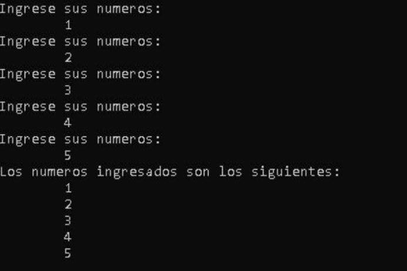

<div style="text-align: justify">

# C++ / Estructura de datos. `Arreglos`.

## Introducción:

Un `arreglo` *también conocido como `array` en inglés* es una estructura de datos que permite almacenar una coleccion del mismo tipo en una secuencia contigua en memoria. Cada elemento en el arreglo se identifica mediante un índice numérico, que comienza desde cero y se incrementa en uno para cada elemento sucesivo. Los arreglos proporcionan una forma eficiente de almacenar y acceder a múltiples valores relacionados bajo un mismo nombre.


## Características de los arreglos en `C++`.

**Tipo y tamaño fijo**: Los arreglos en `C++` deben contener elementos del mismo tipo de datos *por ejemplo, enteros, caracteres, etc*. Además, el tamaño del arreglo se determina en el momento de su declaración y es fijo durante la ejecución del programa. Esto significa que una vez que se crea un arreglo, no se puede modificar su tamaño.

**Índices**: Los elementos en un arreglo están indexados numéricamente. El primer elemento tiene el índice `0`, el segundo tiene el índice `1`, y así sucesivamente. Para acceder a un elemento en particular, se utiliza su índice dentro de corchetes *por ejemplo, `miArreglo[0]` accede al primer elemento*

**Contigüidad en memoria**: Los elementos del `arreglo` se alamacenan de forma consecutiva en la memoria, lo que permite un acceso rápido y directo a cualquier elemento mediante su índice. Esta característica también facilita el recorrido secuencial de los elementos en operaciones como sumas, promedios, entre otros.

**Inicilización**: Los `arreglos` pueden ser inicializados durante su declaración con valores específicos para cada elemento. Por ejemplo, `int miArreglo[3] = {1, 2, 3};` crea un arreglo de enteros con tres elementos inicializados a 1, 2 y 3, respectivamente.

**Uso de bucles**: Dado que los arreglos contienen múltiples elementos del mismo tipo, es común utilizar bucles *por ejemplo, bucle for** para recorrerlos y realizar operaciones en cada uno de los elementos.

**Fuera de limitos**: Es esencial tener cuidado con los índices de los `arreglos`, ya que si se intenta acceder a una posición fuera de los limites del arreglo *por ejemplo, un índice negativo o mayor que el tamaño del `arreglo`*, se producirá un comportamiento indefinido y podría resultar en errores graves o fallas del programa.

`Práctica 1`:

Para comenzar con la práctica de este módulo, necesitamos conocer la estructura básica de `C++`. Una vez familiarizados con ella, procederemos a declarar una variable con el tipo de dato de números enteros. Posteriormente, abriremos corchets `[]` y dentro de ellos, ingresaremos el número `5`. Aquí tienes un código de ejemplo:

```C++
#include<iostream>
using namespace std;
int main()
    {
        int numeros[5];
        return 0;
    }
```

Podemos observar que hemos declarado la variable `numeros`, pero le asignamos `5` entre los corchetes. Esta especificación indica que nuestra variable, que originalmente solo tenía espacio para almacenar un valor, ahora cuenta con 5 espacios. Esto es lo que conocemos como un `arreglo`.

Al igual que con cualquier variable, al declarar un `arreglo`, sus elementos tienen valores nulos inicialmente. Sin embargo, podemos comenzar a manipularlo y asignarle valores.

- `¿Cómo damos valores a un arreglo?`

Continuaremos con la práctica para darle valores a la variable `numeros`. Para ello, llamaremos al arreglo y dentro de los corchetes indicaremos la posición en la que deseamos ingresar el dato. Por ejemplo:

```C++
#include<iostream>
using namespace std;
int main()
    {
        int numeros[5];
        numeros[0] = 3;
        return 0;
    }
```
En el código, hemos asignado el valor `3` a la posición cero del del `arreglo`. Cabe destacar que los `arreglos` en `C++` comienzan a contarse desde el índice cero. A continuación, procederemos a mostrar en pantalla el contenido de la posición cero del arreglo `numeros`.

```C++
#include<iostream>
using namespace std;
int main ()
    {
        int numeros[5];
        numeros[0] = 3;
        cout << numeros[0];
        return 0;
    }
```

Utilizamos `cout` para mostrar en pantalla el contenido del `arreglo` numeros en la posición cero. Aquí tienes una imagen de la consola para visualizar lo que muestra en pantalla:

<div style="text-align:center">


</div>

Efectivamente, nos muestra el número `3` en pantalla.


`Práctica 2`:

En esta segunda práctica, realizaremos la misma actividad, pero daremos valores al `arreglo` desde su declaración. Para lograr esto, en el momento de declarar el arreglo, asignaremos valores utilizando el operador de asignación `=` seguido de llaves `{}`. Dentro de las llaves, ingresaremos los valores de las 5 posiciones de nuestro arreglo. Veamos la siguiente código de ejemplo:

```C++
#include<iostream>
using namespace std;
int main()
    {
        int numeros[5] = { 2, 6, 8, 9, 7};
        return 0;
    }
```

Como podemos observar hemos asignado los siguientes valores al arreglo:

<div style="text-align:center">

En la posición `[0]`: 2
En la posición `[1]`: 6
En la posición `[2]`: 8
En la posición `[3]`: 9
En la posición `[4]`: 7

</div>

Esta es otra manera de asignarle valores a un `arreglo`.Ahora procederemos a mostrar todo el `arreglo` en pantalla utilizando `cout` y llamando a las posiciones del arreglo. Añadiremos una separación entre cada posición del arreglo para una mejor visualización.Tomaremos la siguiente imagen como ejemplo:

```C++
#include<iostream>
using namespace std;
int main()
    {
        int numeros[5] = { 2, 6, 8, 9, 7};
        cout << numeros[0] <<" "<<numeros[1]<<" "<<numeros[2]<<" "<<numeros[3]<<" "<<numeros[4];
        return 0;
    }
```

<div style="text-align: center">


</div>

Como podemos observar, nos muestra los números que fueron asignados durante la declaración del `arreglo`.

`Práctica 3`:

En esta tercera práctica indexamos el `array` utilizando la estructura de repetición `for`, además utilizamos este estructura para mostraar en pantalla los contenidos del `array`, veamos la siguiente imagen de ejemplo:

```C++
#include<iostream>
using namespace std;
int main()
    {
        int numeros[5] = { 2, 6, 8, 9, 7};
        for(int i = 0; i <= 4 ; i++)
            {
                cout<<"Posicion del array: "<<i<<" contenido del array: "<<numeros[i]<<endl;
            }
        return 0;
    }
```
**Consola**:
<div style="text-align: center">


</div>

**Ejercicios**:

1. Realizar un algoritmo donde el usuario pueda ingresar por teclado 5 números a un `array`, una vez ingresados esos 5 números deben ser mostrados en pantalla. A continuación, una imagen del programa:

<div style="text-align: center">



</div>

2. Realizar un algoritmo con el siguiente `arreglo`:

```C++
int arr[] = { 1, 2, 3, 4, 5};
```
Nuestro algoritmo debe multiplicar por 10 cada uno de los numeros en el `arreglo`, nuestro programa debe quedar como la siguiente imagen:

<div style="text-align:center">


</div>

Las primeras 5 lineas de código estan escritas a mano una por una, las 5 ultimas estan creadas con un bucle `for`.

3. Realice un programa donde el usuario pueda ingresar por teclado 3 números, esos 3 números deberán ser guardados en un `arreglo`, y en pantalla se deberán mostrar los números ordenados de menor a mayor, y al final debe preguntarle al usuario si quiere volver a repetir el programa.

<div style="text-align:center">


</div>

4. Realice el algoritmo que genere una carta de presentación, en el cual al usuario se le debe pedir su nombre, su edad, país de origen, ciudad de origen, además la cantidad de mascotas y sus nombres. A continuación, una imagen que podemos usar de ejemplo.

<div style="text-align:center">


</div>

*Ayuda*: Solo permita que el usuario pueda ingresar como máximo 5 mascotas.
</div>